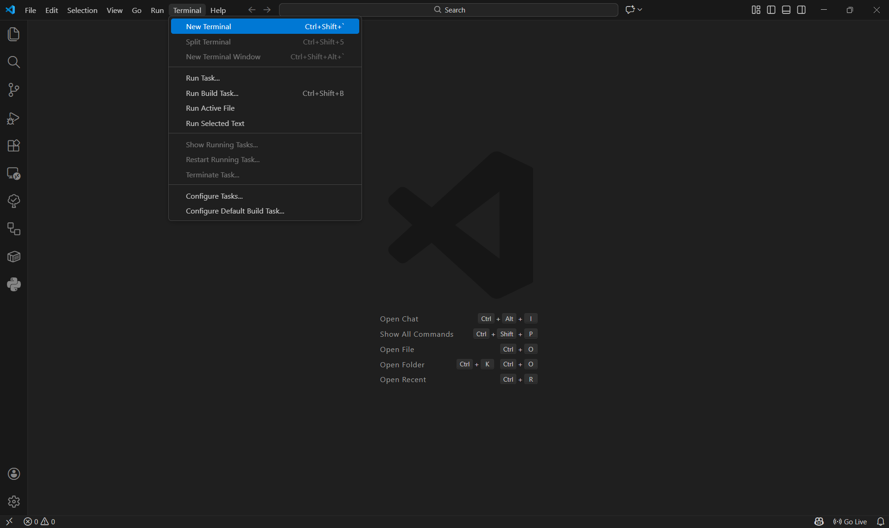
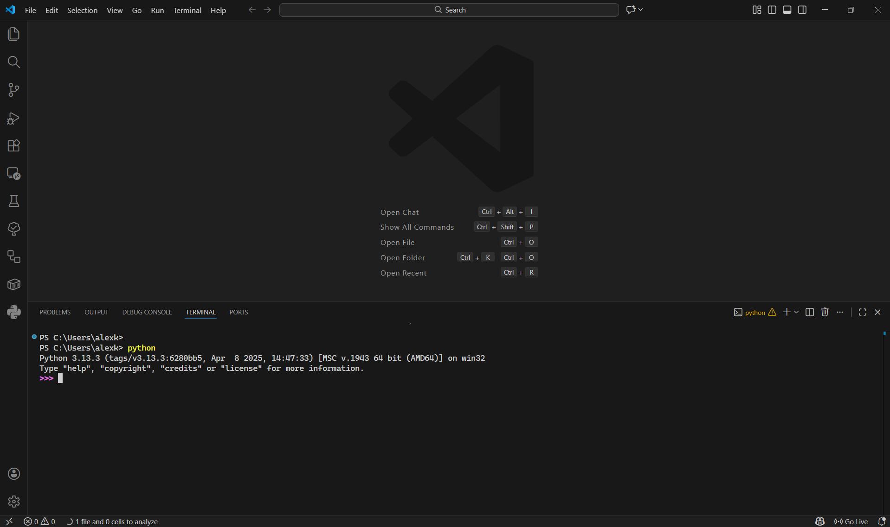
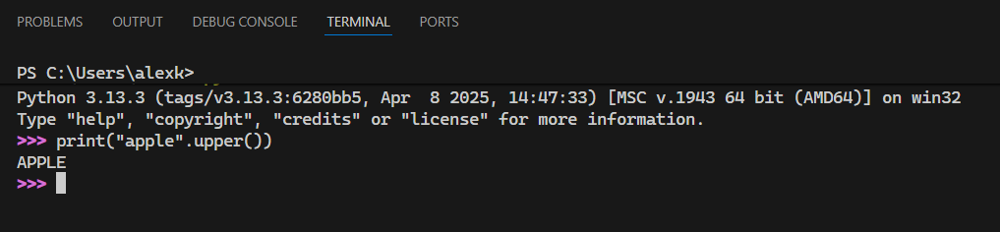

# 🛠️ Tools

Various professions use tools to make it easier to do their job:

- Writers have word processors (Google Docs, MS Word), spell checkers, AI language models, etc.
- Graphic designers have colour palette pickers, Photoshop, vector graphics editors, etc.
- Musicians have score notation software, synths, digital audio workstations, etc.
- Carpenters have sanders, vaccuumns, carving instruments, etc.

So too do programmers have tools, built by programmers for programmers, to make coding much less of a pain. This section will get you up and running with some fundamental programming tools.

## 🪟 Code Editor

As I mentioned previously, I don't use IDLE to write code. It's clunky and doesn't really have many features that make it easy to write code. For one thing, every Python file must be open in a new window. Also, you can't clear the history of commands without closing the app. Plus, there is no autocomplete!

Going forward, we will write our Python code in a professional code editor called [Visual Studio Code](https://code.visualstudio.com/). Click the link and follow the instructions to download it for your platform.
Next, read the [Python in Visual Studio Code](https://code.visualstudio.com/docs/languages/python) tutorial to get VS Code set up for writing Python.

!!! note "Code Editors vs Word Processors"

    MS Word and Google Docs are examples of word processors. These apps deal with _rich_ text, which is text that is embellished with lots of extra notation called **markup** so that the text can have fancy styles like bolding, colours, highlights, and different sizes.

    However, all the markup makes it difficult to write Python code in MS Word. **Please [don't write code using Microsoft Word](https://www.youtube.com/watch?v=X34ZmkeZDos)**.

    Instead we write Python code in a plain text file with the file extension `.py`. Plain text is the kind you would usually write in Notepad (Windows) or TextEdit (Mac). You can't change the styling of the text, but it's much simpler; it's plain.

    We use VS Code, instead of Notepad, because it has features that make it more convenient to edit Python code.
    These include (but are not limited to):

    - Syntax highlighting: some words get a different colour, without extra markup
    - Autocomplete: the editor will suggest the next word based on the context
    - Debugging: This feature lets you run code one instruction at a time
    - Integrated Terminal: This lets you run Python and other computer programs interactively
    - AI Integration: VS Code comes with Copilot. I'm not the biggest fan of AI-based development, but it can definitely help you write code

## 💻 Terminal

A key component of your coding workflow is working with your terminal.
This is the entry point to text your computer commands, like running apps, reading files, downloading software and more.

!!! info "History of Terminals"

    For more about terminals, read [Computer Terminal - Wikipedia](https://en.wikipedia.org/wiki/Computer_terminal).

Unfortunately, the language you use to interface with the terminal is different on different platforms.
On Windows, we use PowerShell, and on MacOS and Linux we use Zsh and Bash, respectively.
For now, the only thing you need to know is how to run Python from your terminal.

To start the Python interpreter app, type `python` (Windows) or `python3` (MacOS/Linux), and you should see something like:

Then we can enter Python commands like we did in IDLE.

## 🌳 Version Control

> Section in Progress ✏️

## 🏋️‍♂️ Exercises

**Q1.** What is the difference between rich text and plain text?

??? success "Answer"

    Rich text is embedded with additional markup to provide styles and semantics.
    MS Word support rich text, like bolding, italics, section headers, titles, clickable links, etc.

    Plain text is just the characters.
    VS Code, Notepad (Windows), and TextEdit (MacOS) only support plain text, which is the kind we want for code.

**Q2.** Visit the tutorial at [https://code.visualstudio.com/docs/getstarted/getting-started](https://code.visualstudio.com/docs/getstarted/getting-started). Make sure to follow the instructions on installing the **Python extension** and **version control**!

**Q3.** Visit the tutorial at [https://code.visualstudio.com/docs/python/python-quick-start](https://code.visualstudio.com/docs/python/python-quick-start). Specifically, understand how to run your code.

**Q4.** What is version control? Why is it useful?