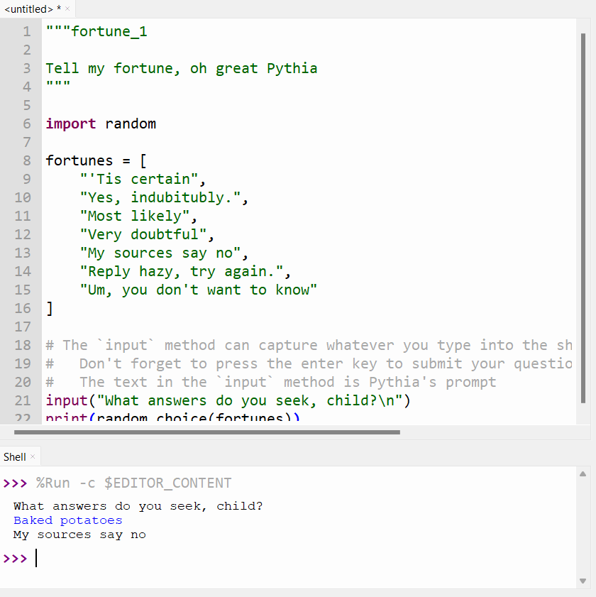
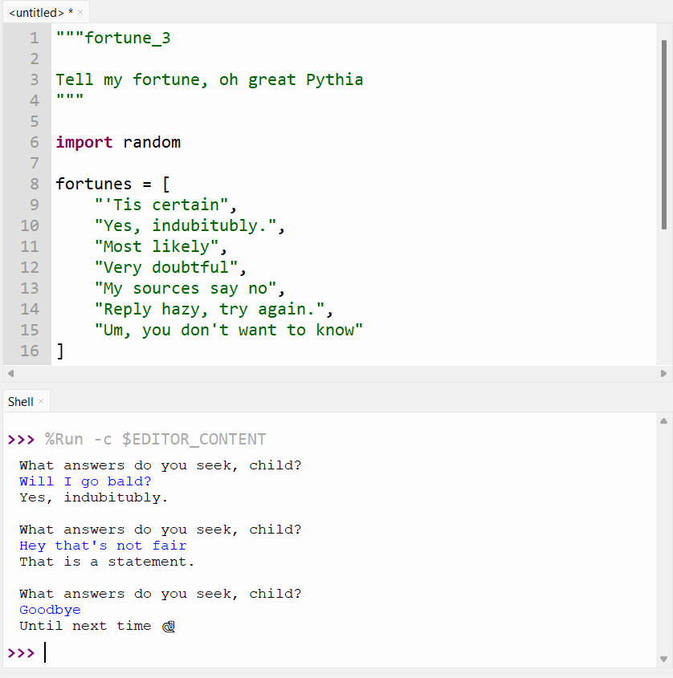

# Fortune Telling

The stars are aligning. Mercury is in retrograde.
My astrologist said I have a healthy aura this month.
But ... my astrologist is really freaking expensive.
Sadly, I can't afford any more of their readings 🫤.

However, fortune bestows her favour upon me, for I can channel the spirit of
the Pythoness[^1] - the great Oracle of Delphi - by reciting a few lines of the sacred language, Python 🙏.

[^1]: Disclaimer: your Python code is (probably) not actually haunted by the spirit of [Pythia (Wikipedia)](https://en.wikipedia.org/wiki/Pythia), a prominent oracle in greek mythology.


> Fig 1. Tell my fortune, oh great Pythia
>  
> _Priestess of Delphi_ (1891) by <a href="https://en.wikipedia.org/wiki/John_Collier_(painter)">John Collier</a> on <a href="https://en.wikipedia.org/wiki/Pythia#/media/File:John_Collier_-_Priestess_of_Delphi.jpg">Wikipedia</a>

---

## 🐍 The Code

!!! note "It's normal to be confused. In fact, it's all part of the plan."

    The code below is purposely NOT explained in detail.
    The goal here is simply to get exposed to writing Python code.
    Before understanding the why and how, we first need to develop some baseline familiarity with typing Python and running code in Thonny.

!!! danger "Type, don't copy"

    Manually type out the all the code below into the Thonny editor.
    You're **wasting your time** if you just copy and paste.

Pythia sees all, knows all, but has a fairly limited list of possible responses.

```python title="fortune.py"
--8<-- "1-Fortune-Telling/fortune/fortune_0.py"
```

Hm, but wait, it doesn't really make sense for Pythia to give us unsolicited fortunes.
We should be able to ask her a question, first.

```python title="fortune.py"
--8<-- "1-Fortune-Telling/fortune/fortune_1.py"
```

That's better. But it's weird for her to respond if we don't ask a question.



Pythia should double check that we've asked her a question.

```python title="fortune.py"
--8<-- "1-Fortune-Telling/fortune/fortune_2.py"
```

Finally, Pythia is a patient seer, and will continue to answer our questions until we are satisified.

```python title="fortune.py"
--8<-- "1-Fortune-Telling/fortune/fortune_3.py"
```



## 🪞 Reflection

> Section in progress ✏️. Come back soon.

!!! note "Order of execution"

    As always, Python code is executed from top to bottom, one line at a time
    so the order of our instructions really matters!