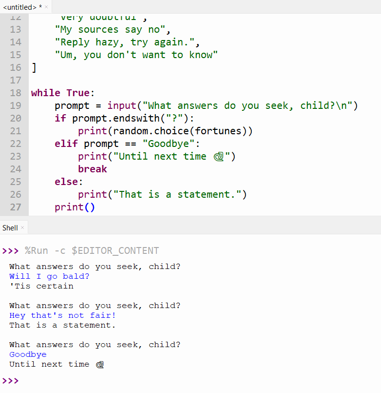

# Fortune Telling

The stars are aligning. Mercury is in retrograde.
My astrologist said I have a healthy aura this month.
But ... my astrologist is really freaking expensive.
Sadly, I can't afford any more of their readings 🫤.

However, fortune bestows her favour upon me for I can channel the spirit of
the Pythoness[^1] - the great Oracle of Delphi - by reciting a few lines of the sacred language, Python 🙏.

[^1]: Disclaimer: your Python code is (probably) not actually haunted by the spirit of [Pythia (Wikipedia)](https://en.wikipedia.org/wiki/Pythia), a prominent oracle in greek mythology.


> Fig 1. Tell my fortune, oh great Pythia
>  
> _Priestess of Delphi_ (1891) by <a href="https://en.wikipedia.org/wiki/John_Collier_(painter)">John Collier</a> on <a href="https://en.wikipedia.org/wiki/Pythia#/media/File:John_Collier_-_Priestess_of_Delphi.jpg">Wikipedia</a>

---

## 🐍 The Code

!!! note "It's normal to be confused. In fact, it's all part of the plan."

    The code below is purposely NOT explained in detail.
    There are two reasons:

    1. **To develop familiarity with Python** -
    Before understanding the why, we first need to develop some baseline familiarity with typing Python and running code in Thonny.
    2. **To get comfy with being confused** - Being confused about novel code is completely normal for even experienced programmers, and it's good to practice getting used to that. In general, being able to sit with the discomfort of confusion is a useful skill when learning.

!!! danger "Type, don't copy"

    Manually type out the all the code below into the Thonny editor.
    You're **wasting your time** if you just copy and paste.

Pythia sees all, knows all, but has a fairly limited list of possible responses.
She's a bit picky and expects questions with "yes" or "no" answers.

```python title="fortune.py"
--8<-- "1-Fortune-Telling/fortune/fortune_0.py"
```

She chooses an answer according to the Spirit of Delphi, which is fickle
and divinely random.

```python title="fortune.py"
--8<-- "1-Fortune-Telling/fortune/fortune_1.py"
```

Hm, but wait, Pythia shouldn't be giving us unsolicited fortunes.
We should ask her a question, first.

```python title="fortune.py"
--8<-- "1-Fortune-Telling/fortune/fortune_2.py"
```

!!! question "What if you did this?"

    What happens when you remove the `\n` character?
    Re-run the script and compare the difference.

That's better. But it's weird for her to respond if we don't ask a question.


Pythia should double check that we've asked her a question.

```python title="fortune.py"
--8<-- "1-Fortune-Telling/fortune/fortune_3.py"
```

!!! tip

    Pressing the `enter` key will submit your question to Pythia.
    Make sure to type your question first.

Finally, Pythia is a patient seer, and will continue to answer our questions until we are satisified.

```python title="fortune.py"
--8<-- "1-Fortune-Telling/fortune/fortune_4.py"
```



## 🪞 Reflection

Take the time to complete the following reflection questions.

**Q1.** Modify the code so that Pythia asks `"What do you desire to know?"`

??? success "Answer"

    Change this line:

    ```python
    prompt = input("What answers do you seek, child?\n")
    ```

    To this instead:

    ```python
    prompt = input("What do you desire to know?\n")
    ```

**Q2.** Pythia has sensitive ears. Modify the code so she tells us to quiet down if we yell at her.
For example, if we tell her `WHY IS CODING SO HARD?` or `WHYYYYYYYYY?!?!?`, she should respond with
`"Shush! I have sensitive ears and can't concentrate on the future if you yell at me"`

!!! note "Not knowing is normal"

    You probably will have a tough time coming up with an answer. This is normal!
    What's more important is you try your best to think of a solution for at least a few minutes.
    Learning this way will help you remember things better, I promise.

    After thinking on your own, read through the answer below.
    Even if the answer doesn't make sense, that's ok too!
    Just keep reading and trying the problems.

??? success "Possible Answers"

    First, we should rephrase the problem into a condition that we can check.
    Really, the question is asking us to check if the prompt we give to Pythia is in upper case letters or not.

    Next, we should figure out how to check if text is in upper case in Python.
    In the previous section we saw the `"apple".upper()` which could transform text to uppercase,
    but that's not what we want.

    A quick google search (or asking your preferred AI chatbot) will tell you that we can use a command called 
    `.isupper()`

    So we could write:

    ```python
    """fortune_4

    Tell my fortune, oh great Pythia
    """

    import random

    fortunes = [
        "'Tis certain",
        "Yes, indubitubly.",
        "Most likely",
        "Very doubtful",
        "My sources say no",
        "Reply hazy, try again.",
        "Um, you don't want to know"
    ]

    while True:
        prompt = input("What answers do you seek, child?\n")
        if prompt.endswith("?"):
            print(random.choice(fortunes))
        elif prompt.isupper():
            print("Shush! I have sensitive ears and can't concentrate on the future if you yell at me") 
        elif prompt == "Goodbye":
            print("Until next time 🐍")
            break
        else:
            print("That is a statement.")
        print()
    ```

    However, there is a problem! Here we first check if we have a question, but that will skip the check for upper case letters. Pythia won't even answer the question if we yell it at her, so we should change the order to:

    ```python
    """fortune_4

    Tell my fortune, oh great Pythia
    """

    import random

    fortunes = [
        "'Tis certain",
        "Yes, indubitubly.",
        "Most likely",
        "Very doubtful",
        "My sources say no",
        "Reply hazy, try again.",
        "Um, you don't want to know"
    ]

    while True:
        prompt = input("What answers do you seek, child?\n")
        if prompt.isupper():
            print("Shush! I have sensitive ears and can't concentrate on the future if you yell at me")
        elif prompt.endswith("?"):
            print(random.choice(fortunes))
        elif prompt == "Goodbye":
            print("Until next time 🐍")
            break
        else:
            print("That is a statement.")
        print()

    ```

**Q3.** Make a list of everything that confused you. Here are some sample prompts to get you started:

??? success "Possible Answers"

    - Why did we add the word `break`?
    - What does `input()` do?
    - Why are there triple quotes (`"""`) at the beginning of the file?
    - What does `import random` do?
    - How accurate are these fortunes?
    - Why did we write `while True`?
