# 🐍 The Python Language

Python is famous for being an easy-to-learn, yet powerful, programming language.
The Python language is, in some ways, very similar to English.
Let's compare Python and English by looking at key components of languages in general:
1) Interpreters, 2) Syntax, and 3) Semantics.

## 🧠 Interpreters

You can write instructions in English like

```text
Hey, write the word 'apple' in uppercase letters
```

Of course, nothing will happen if you write down these instructions on a piece of paper,
or if you say these instructions out loud in an empty room.

Instructions in any language are only useful if there is someone there to **interpret** the instructions.
So, let's say you text your friend the instructions to write "apple" in uppercase. They respond with "APPLE". Your friend is the interpreter for the instruction.

The Python language is the same. On its own the language is kind of useless, it's just a bunch of rules for how to arrange words and numbers. You need a Python **interpreter** that can understand the instructions and execute them.

```mermaid
flowchart LR
    lang(["Hey, write 'apple' in upper case letters"]) -- "👂 Listen" --> interp["Person"]
    interp["Person"] -- "✍️ Write" --> result(["'APPLE'"])
    style interp fill:#36464e,stroke:#333,color:#fff
```

```mermaid
flowchart LR
    lang(["print('apple'.upper())"]) -- "👂 Parse" --> interp["Python Interpreter"]
    interp["Python Interpreter"] -- "✍️ Print" --> result(["'APPLE'"])
    style interp fill:#36464e,stroke:#333,color:#fff
```





!!! info "Where can I get a Python interpreter?"

    While you could download the latest traditional[^1] Python interpreter from the [Python Software Foundation](https://www.python.org/downloads/), for this tutorial we will use [Thonny](https://thonny.org/). It comes with version 3.10 of the Python interpreter (the latest version is 3.11, as of time of writing). When we get more experience using Python, we will learn how to update to the latest Python interpreter.
    
    [^1]: By "traditional", we mean the interpreter that most people and companies use. There's no "pirated" version of the Python interpreter because it's completely open-source and free! There are, however, several alternative implementations of the Python interpreter, like PyPy (for Python that runs fast), or MicroPython (for running Python on micro controllers). Most people should stick to the interpreter from the [Python Software Foundation](https://www.python.org/psf-landing/)

!!! tip "Python Interpreter Cost & Licensing"

    The Python interpreter is free. It's also **open-source**

Follow the installation instructions for [Thonny](https://thonny.org/) for your operating system (i.e. Windows or Mac)

!!! note "Thonny Initial Settings"

    Make sure to pick "Standard"
    
    


When the software is finished installing, open it. You should see something like this:


## 📝 Syntax 

**Syntax** means the correct (i.e. mutually agreed-upon, or comprehensible) way to structure sentences

For example, in English we say "My birthday is today!", but we wouldn't say "is !my today Birthday"
The second sentence uses the exact same words and punctuation, but it doesn't make sense.
It doesn't use correct English syntax.

Python also has a syntax; there is a right and wrong way to structure sentences in Python.

|Language| Comprehensible | Incomprehensible |
| --- | --- | --- |
| 📝 English | `Hey, write the word 'apple' in uppercase letters` | `'apple' in, uppercase write Hey letters word the` |
| 🐍 Python | `print('apple'.upper())` | `Hey, write the word 'apple' in uppercase letters` |

Let's revisit the sum example, where you texted your friend:

```
Hey, write the word 'apple' in uppercase letters
```

If you try typing this into Thonny, specifically the section of the app that says "Shell", then press `enter`:


The Python interpreter doesn't understand what we're saying, because we haven't structured the sentence correctly in the Python language. Unlike your friend, the Python interpreter won't bother to ask us to clarify or rephrase what we meant. It will give up trying to understand our instructions very quickly, but will usually tell us why it gave up.
In this case, the interpreter gave up, or **threw an error**, because it didn't understand the syntax of the instruction we provided to it. The Python interpreter doesn't speak English, it speaks Python.

!!! note "Entering instructions"

    After we finish typing an instruction, we need to enter the instruction into the interpreter by pressing the `enter`/`return` key on our keyboard; this is what we mean by entering an instruction. 
    
    This is the same as when you type in a search query into Google or Bing. You have to hit enter for the search engine to actually start searching.

    After we enter an instruction, the Python interpreter will try to understand the instruction and, if it does, will return the result of the instruction on the screen

Python can be tricky initially because:

1. We're not yet fluent in the language
2. We're used to human languages, which are a lot more flexible than Python[^2]

[^2]: In my opinion. The interpreters for natural languages, our brains, are extraordinarily complex, flexible, and powerful, and the power of a language tends to be limited to the complexity of its interpreter.

There are lots of valid ways to ask someone to write "apple" in uppercase letters, but in Python we say:

=== "Python"

    ```python
    print('apple'.upper())
    ```

=== "English"

    ```text
    Hey, write the word 'apple' in uppercase letters
    ```


## 💡 Semantics

You can have sentence with correct syntax, yet it doesn't make sense.
The meaning, or _semantics_, of sentences are extremely important.

Here's an example of a syntactically correct, but semantically meaningless, sentence in English:

```text
Write the number 1.50 in upper case
```

Here's the same example in Python:

```python
1.50.upper()
```

When you give the Python interpreter a semantically meaningless sentence, the interpreter will throw an error, but usually a different kind of error depending on what you were trying to do.


!!! note "Errors"

    The Python interpreter will throw lots of different kinds of errors.
    We will discuss types of errors and how to handle them later in the guide.


!!! danger "Python is not English"

    We have spent quite a bit of time emphasizing the similarities between Python and English to help us get comfortable with the idea of programming languages,
    but it is important to keep in mind that programming languages and natural languages are **very** different things.
    
    Python sometimes looks like English, and uses English words; this is a blessing and a curse for native Enlgish-speakers.
    English words give Python a sense of familiarity, but this may tempt you to write Python the way you would in English. In the beginning, you will find yourself trying to express things that seem completely valid and natural in English, but are nonsensical to the Python interpreter.

    To non-native English speakers, Python may seem more foreign.
    However this may make it easier to treat Python as something with its own system of rules,
    as something that works differently on a fundamental level from your native language.


## 🏋️‍♀️ Exercises

We'll look at a lot of examples of how to write Python with proper syntax throughout this tutorial.
For now, I highly recommend you try the exercises below.


**Q1.** What is an interpreter?

??? success "Answer"

    Something that can understand instructions in a language and execute those instructions

    For the English language, people are the interpreter.

    For Python, it is a piece of software called the Python Interpreter. 

**Q2.** What is syntax?

??? success "Answer"

    Syntax is the structure of sentences in a language.

**Q3.** Imagine you want your friend to throw a frisbee at you. State whether each sentence has the correct syntax in English:


i. "Hey! Hey! Hey! Frisbee! Hey! Frisbee! Frisbee!"

ii. "Hey, throw the Frisbee here!"

iii. "May you please pass that rotating plastic disk to my general direction by means of sudden impulse using your hands?"

iv. "Frisbee here now the !throw"

??? success "Answer"

    i., ii., and iii., are perfectly valid ways to ask for a frisbee in English

    iv. is not valid English syntax

**Q4.** Write the following sentence[^3] in lower case letters:

[^3]: [Monty Python](https://youtu.be/Cj8n4MfhjUc) skit. By the way, the Python language was named after this comedy group, not the snake!

```text
NOBODY EXPECTS THE SPANISH INQUISITION!
```

??? success "Answer"

    The phrase is short enough that you could retype it in lower case yourself:

    ```text
    nobody expects the spanish inquisition!
    ```

    But it's faster to use Python (and more scalable; imagine rewriting a much longer sentence by hand)

    ```python
    'NOBODY EXPECTS THE SPANISH INQUISITION!'.lower()
    ```
    or
    ```python
    "NOBODY EXPECTS THE SPANISH INQUISITION!".lower()
    ```

    The Python language is particular about many things, but quotation marks are not one of those things.
    It's up to you to use single-quotes or double-quotes, but it's good style to be consistent with your choice.

**Q5.**

Consider this quote[^4]:

[^4]: Dr. Ian Malcolm, _Jurrasic Park_

```text
God creates dinosaurs. God destroys dinosaurs. God creates Man. Man destroys God. Man creates dinosaurs.
```

Using the string methods described in the documentation:

i. Replace `dinosaurs` with `yogurt`

!!! info "Hint"

    If we want to replace words in a sentence, we can do this:

    ```python
    print("It is morning time".replace("morning", "evening"))
    ```

ii. Which letter occurs more frequently, `e` or `a`?

!!! info "Hint"

    Try using something like:
    ```python
    "The quick brown fox jumped over the lazy dog.".count("the")
    ```

??? success "Answer"

    Note that the `>>>` represents the prompt in the "Shell" section of Thonny.
    You shouldn't type the arrows into the Shell.

    i.

    ```python
    >>> 'God creates dinosaurs. God destroys dinosaurs. God creates Man. Man destroys God. Man creates dinosaurs.'.replace('dinosaurs', 'yogurt')
    'God creates yogurt. God destroys yogurt. God creates Man. Man destroys God. Man creates yogurt.'
    ```

    ii. 

    ```python
    >>> 'God creates dinosaurs. God destroys dinosaurs. God creates Man. Man destroys God. Man creates dinosaurs.'.count('e')
    8
    >>> 'God creates dinosaurs. God destroys dinosaurs. God creates Man. Man destroys God. Man creates dinosaurs.'.count('a')
    9
    ```

    So, there are more `a`s that `e`s in the quote.


**Q6.** If you haven't already, skim through the [official Python tutorial](https://docs.python.org/3.11/tutorial/). A lot of it might not make sense just yet, but you should still look through it to get some more context about Python

**Q7.** Finally, and most importantly, why do you want to learn Python?

??? success "Possible answers"

    1. Develop industry-relevant skills
    2. I need to pass a course in school
    3. Automate boring, repetitive tasks at work and home
    4. Learn for the fun of it
    5. I'm soooooooooooo boooooooored
