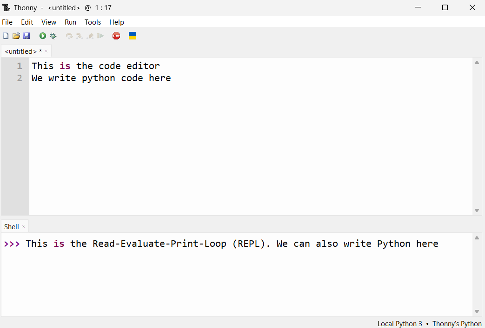
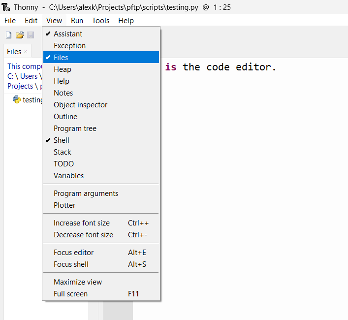

# 👩‍💻 Programming

## 🪟 Editors

Let's get familiar with the two main parts of Thonny.



1. The **code editor**: This is where we will write our Python code.
We use this section when we write multiple lines of code that we want to execute all at once.

!!! tip "Running programs"

    Press the green run button to execute the code in the code editor 

2. The **REPL**: This stands for Read-Evaluate-Print-Loop. This bit is interactive. When we enter a valid Python instruction (that is, type the instruction after the `>>>` then press the `enter`/`return` key), we will immediately see the result. We usually write short lines of code here when we want to test something quickly.

!!! tip "Command History"

    When using the REPL, you can press the `up` arrow key to load a previous command

Thonny is an **IDE**: An Integrated Development Environment. An IDE is any kind of editor that has multiple sections that are for different things, like editing code, running coding interactively (like a REPL), and managing files.

!!! note "Code IDEs vs Word Processors"

    MS Word and Google Docs are examples of word processors. These apps deal with _rich_ text, which is text that is embellished with lots of extra notation called **markup** so that the text can have fancy styles like bolding, colours, highlights, and different sizes.

    However, all the markup makes it difficult to write Python code in MS Word. **Please [don't write code using Microsoft Word :fontawesome-solid-up-right-from-square:](https://www.youtube.com/watch?v=X34ZmkeZDos)**

    Instead we write Python code in a plain text file with the file extension `.py`. Plain text is the kind you would usually write in Notepad (Windows) or TextEdit (Mac). You can't change the styling of the text, but it's much simpler; it's plain.

    We use Thonny, instead of Notepad, because it has features that make it more convenient to edit Python code.
    These include (but are not limited to):

    - Syntax highlighting: some words get a different colour, without extra markup
    - Debugging: This feature lets you run code one instruction at a time
    - Shell: This lets you run Python interactively 


To see your files, select "View" then check "Files" in the menu.




## 💡 Coding is Writing is Thinking

Writing Python code is more than typing some words into Thonny.
It is writing, and writing is thinking on paper.
People who write well know how to sort out their thoughts, critique them, refine them, and express them in an accessible way to other people. The same can be said for Python. You can write convoluted, broken code, or write simple, elegant, and correct code that says nothing beyond what it needs to say, to do the things it needs to do.

Just like writing, learning to code well takes time. Google developer and leading AI-researcher Peter Norvig wrote about this best in his blog post [Teach Yourself Programming in Ten Years](https://www.norvig.com/21-days.html). Do not be tempted to skim! Read it over in its entirety to set your expectations for learning to code.

!!! abstract "Read it!"

    Even if you don't understand most of it, please read [Teach Yourself Programming in Ten Years](https://www.norvig.com/21-days.html).
    The blog post is aimed at people interested in software development, but even if that is not you, all I want you to get out of it is that learning to code will take time and effort, so don't worry if you feel it's taking a long time for you get the hang of Python. We're all in the same boat!

## 🔨 Solving Problems with Code

It's important to have a good grasp of the problem you're trying to solve with Python
(or knowing if you even need Python at all!). 
For some problems, it makes sense to write a **program**, i.e. a recipe of computations.
Allen Downey, author of the wonderful (free!) book [Think Python](https://greenteapress.com/thinkpython2/html/thinkpython2002.html), says that there are really only 5 kinds of instructions that compose a program:

| Instruction | Description|
| --- | --- |
| Input | Get data from the keyboard, a file, the internet, or some other device |
| Output | Display data on the screen, save it in a file, send it over the internet, etc|
| Math | Perform some number-crunching (add a number here, multiply some numbers there) |
| Conditional Execution | Check for certain conditions and run the appropriate code |
| Repetition | Perform some action repeatedly, usually with some variation each time |

Basically, if you can express your problem as some combination of these instructions, you can write
a program in Python to get your computer to solve your problem for you.

## 🛞 Process & Design

It's very easy to write a terrible essay; you simply need to write, and then stop writing.
Writing a great essay takes research, planning, writing, and multiple rounds of revisions and gathering feed-back.
A similar thing happens (or at least, _should_ happen) when writing software (i.e. code).
It's easy to write code that doesn't actually solve your problems correctly or robustly.

In his book, [Code Complete](https://en.wikipedia.org/wiki/Code_Complete), Steve McConnell laid out a few key components of the software development process[^1]:

[^1]: The full software development process is much lengthier and much more involved, but this list is good enough for most of the software you write as beginner Python programmer

<!-- TODO: Turn into flow chart -->

| Step of Process | Description |
| --- | --- |
| Problem definition | What problem are we trying to solve? (Don't offer solutions yet!) |
| Requirements development | What features does our solution have to have? Does Python offer these features? |
| Construction planning | Think about how we could implement the solution, step by step |
| Coding & debugging | Implement the solution in Python. Fix bugs. |
| Testing | Test! Test! Test! Write lots of tests for your Python code. Retest when you make changes |

## 📦 Scripts vs Apps vs Libraries

A **script** is a short piece of code, usually in a single file, that does one main thing.
For example, this script fetches a random useless fact from the internet:

```python title="uselessfact.py"
--8<-- "uselessfact.py"
```

!!! tip "Try it yourself"

    You don't need to _how_ this code works at this point in the guide, but try typing this code into
    the code editor section of Thonny (the top portion, not the Shell).
    Then press the green run button, and look at the Shell section to see the result.

    Try re-running the script a few times to see different useless facts. 

Scripts are different from applications, or **apps**, which are bundles of code that you use to accomplish one or more tasks. 
Apps are typically more complicated than scripts.
Compare the script above to something like your calendar app, which can send notifications, set reminders, store data related to events, dates, and times, has a user interface, and can synchronize data across multiple devices.

There is another kind of software called a **library**.
A library is a bundle of code that is meant to be used in other people's code.
Libraries tend to be pretty hard to write because you have to think about how the code will be used on many different operating systems, and write lot's of tests, publish documentation on how to use the library, and maintain it when people find bugs or are looking for more features.
Python developers typically use the word "**packages**" instead of library.
[PyPI](https://pypi.org/) is where you can find Python packages. 

Specific to Python, we have **modules**. These are files with reusable bits of code.
Python comes pre-installed with many modules.
For example, we can use the `random` module which lets us write code that can generate random numbers

```python title="Python random module"
import random
print("Here's a random number from 1 to 10:", random.randint(1, 10))
```

We need to write `import random` to tell the Python interpreter to load the code from the random module.
It's a good thing the interpreter doesn't automatically load every single built-in module,
otherwise it would take a while to start up. Better for us to explicitly ask for specific modules.

!!! note

    In this guide, we will stick to writing modules and scripts

## 🏋️‍♂️ Exercises

**Q1.** What's an IDE?

??? success "Answer"

    An Integrated Development Environment. It's a piece of software that makes it
    easier to write and edit code.

**Q2.** What is a program? What are the different instruction types for a program?

??? success "Answer"

    A program is a sequence of instructions of how to perform a computation.
    In other words, a recipe of computations.

    | Instruction | Description|
    | --- | --- |
    | Input | Get data from the keyboard, a file, the internet, or some other device |
    | Output | Display data on the screen, save it in a file, send it over the internet, etc|
    | Math | Perform some number-crunching (add a number here, multiply some numbers there) |
    | Conditional Execution | Check for certain conditions and run the appropriate code |
    | Repetition | Perform some action repeatedly, usually with some variation each time |

**Q3.** What is the process for writing code?

??? success "Answer"

    | Part of Process | Description |
    | --- | --- |
    | Problem definition | What problem are we trying to solve? (Don't offer solutions yet!) |
    | Requirements development | What features does our solution have to have? Does Python offer these features? |
    | Construction planning | Think about how we could implement the solution, step by step |
    | Coding & debugging | Implement the solution in Python. Fix bugs. |
    | Testing | Test! Test! Test! Write lots of tests for your Python code. Retest when you make changes |

**Q4.** What is the difference between a script, an app, and a library? Provide an example for each

??? success "Answer"

    | Type of Software | Description | Example |
    | --- | -- | --- |
    | Script | Typically a single file of code that accomplishes a few simple/short tasks | A script to download files from the internet |
    | App | A bundle of software that people use to accomplish a few complicated tasks | [Thonny](https://thonny.org/) is an app for editing Python code |
    | Library| A bundle of software that people can use in their own code | [pandas](https://pandas.pydata.org/) is data analysis library for Python |


**Q5.** Consider this Python code that verifies if someone is old enough to drink

```python
age = int(input("Please enter your age: "))

drinking_age = 19

if age == drinking_age:
    print("You may enter the bar")
else:
    print("Sorry, you are not old enough to drink")
```

Type it into Thonny, then run it. You can enter an age by typing it into the Shell, then pressing the `enter`/`return` key.


i. Does the program do what it's supposed to? Why or why not? Rerun the code and try a few different ages

??? success "Answer"

    **No**, the code produces an incorrect result for ages greater than 19. It should respond "You may enter the bar", but doesn't.

    This is because the code checks if `age` equals `drinking age`. Instead it should check if `age` is greater than or equal to `drinking_age`.
    
    Don't worry if you weren't sure how to read the Python script, yet (after all, we haven't properly gone over the basic words and phrases you can use in Python).
    
    If you were able to figure it out, great! Can you try and fix the code? 

ii. Can you think of any inputs you can give that will crash the program (i.e. cause it to throw an error)?

??? success "Answer"

    The program will crash if you provide inputs that don't make any sense, like letters or punctuation.

    If you haven't already, try running the code again and input `abc` or something similar.

iii. Why is testing your code so important?

??? success "Possible Answer"

    It's easy to accidentally mistype something without realizing it, so you need to run tests to bring your attention to errors in your code

    It's also useful to think about all the invalid inputs that you or other people could give when using your Python scripts. Testing and then tweaking your code helps make sure your scripts are more robust.
