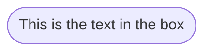
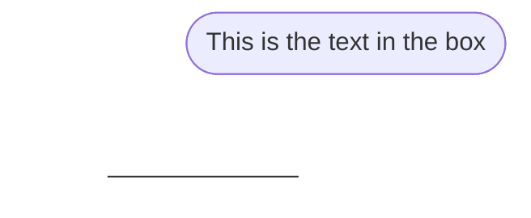

# 🪶 Hocus Focus

> How do you focus so well?"

I can't. At best I can study for 25 minutes. Then I need a break.
But usually 5 minutes of just looking at puppy photos is all I need to cool down my brain

> That's kinda weird, but also kinda nice"

"Yeah"

"So, do you use an app for that? Like a pomodor timer or something?"

"I tried a few, but I didn't really vibe with them.
Plus, none of them would show me puppies during my break, so I made my own"

"Woah what, how?"

"I wrote a Python script"

## Setup

