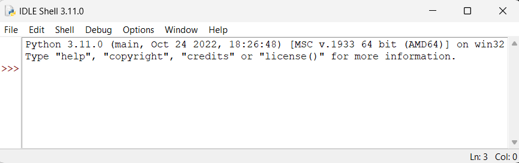
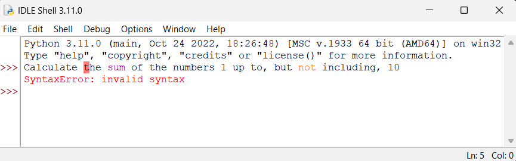
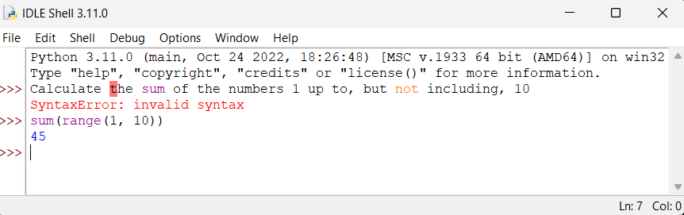
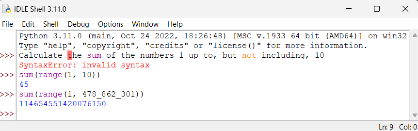

# The Python Language 🐍

Python is famous for being an easy-to-learn, yet powerful, programming language.
The Python language is, in some ways, very similar to natural languages like English.
Let's compare Python and English by looking at key components of languages in general:

1. Interpreters
2. Syntax

## Interpreters 👂

You can write instructions in English like

```text
Calculate the sum of the numbers 1 up to, but not including, 10
```

Of course, nothing will happen if you write down these instructions on a piece of paper,
or if you say these instructions out loud in an empty room.

Instructions in any language are only useful if there is someone there to **interpret** the instructions.
So, you text your friend the instructions to sum up the numbers. They respond with "45". Your friend is the interpreter for the instruction.

The Python language is the same. On its own the language is kind of useless, it's just a bunch of words and numbers arranged in a specific way. You need a Python **interpreter** that can understand the instructions and follow them.

!!! info "Where can I get a Python interpreter?"

    You can download the "official"[^1] Python interpreter [here](https://www.python.org/downloads/).
    This tutorial uses version `3.11`.

    [^1]: By "official", we mean the most up-to-date interpreter. There's no "pirated" version of the Python interpreter because it's completely open-source and free!

Follow the installation instructions for your operating system (i.e. Windows or Mac), then when the software is finished installing, test to see if Python works. We test the Python installation by running the IDLE program

!!! note "What's IDLE?"

    IDLE is the name of the Python interpreter. It stands for 
    
    - **I**ntegrated
    - **D**evelopment (and)
    - **L**earning
    - **E**nvironment

=== "Windows"

    Click the "Start" menu, then search for "Python IDLE". Open the app.

=== "Mac"

    Click the "Spotlight" menu, then search "Python IDLE". Open the app.

You should see something like this:





## Syntax 📝

**Syntax** is the structure of words in a sentence.

For example, in English we say:

```
That dog is so fluffy and cute!
```

But we wouldn't say:

```
fuffy !That so dog cute is
```

The sentence above uses the exact same words and punctuation, but it doesn't make sense.
It doesn't use correct English syntax.

Python also has a syntax, a right and wrong way to structure sentences.

Let's revisit the sum example, where you texted your friend:

```
Calculate the sum of the numbers 1 up to, but not including, 10
```

If you try typing this into IDLE:




The Python interpreter doesn't understand what we're saying, because we haven't structured the sentence correctly in the Python language.

Python can be tricky initially because:

1. We're not yet fluent in the language
2. Our human languages are much more powerful and flexible than Python

There are lots of valid ways to ask someone to sum up the numbers 1 up to, but not including, 10 in English or any other human language. But in Python we say

```python
sum(range(1, 10))
```



Python looks like a bare-bones version of English, kind of like a cave-person language. But it's still pretty powerful.
Now imagine you text your friend

```
Calculate the sum of the numbers 1 up to, but not including, 478,862,301
```

It would probably take your friend a significantly longer amount of time to do this calculation by hand. 
But the Python interpreter just takes a few seconds:



!!! note "Syntax for numbers"

    We could write `478862301`, but that's a little tricky to read.
    Lot's of languages have ways to make numbers easier to read, including Python.

    | Language | Separator | Syntax |
    | --- | --- | --- |
    | English | comma (`,`) | `478,862,301` |
    | French | period (`.`) | `478.862.301` |
    | **Python** | underscore (`_`) | `478_862_301` |


We'll look at a lot of examples of how to write Python with proper syntax throughout this tutorial.
For now, I highly recommend you try the exercises below.

## Exercises 🏋️‍♀️


**Q1.** What is an interpreter?

**Q2.** What is syntax?

**Q3.** Which of the following has the correct syntax for asking someone to throw a Frisbee in English?


a) "Hey! Hey! Hey! Frisbee! Hey! Frisbee! Frisbee!"

b) "Hey, throw the Frisbee here!"

c) "May you please pass that rotating plastic disk to my general direction by means of sudden impulse using your hands?"

d) "Frisbee here now the !throw"


**Q4.** Which of the following has the correct syntax for displaying the numbers 1 up to, but not including, 5 in Python?

!!! note "Hint"

    Try typing all these options into IDLE. Which ones result in a syntax error? Which ones work, but don't give the correct answer?

a)
```python
print(range(1, 5))
``` 

b)
```python
print range(1, 5)
```

c)
```python
print(*range(1, 5))
```

d)
```python
print(1 up to, but not including, 5)
```

**Q5.** Type `help()` in the interpreter, then press the return/enter key. Read the text.

**Q6.** If you haven't already, skim through the [Python tutorial](https://docs.python.org/3.11/tutorial/). A lot of it might not make sense just yet, but you should still look through it to get a feel for Python.
