# 🐍 Python Language

The English is a language used by people to communicate with other people.

Python is a language used by people to communicate with computers.

## 🧠 Interpreters

---

1. Language is useless without **Interpreter**.

2. **Interpreters** understand languages and do actions.

```mermaid
flowchart LR
    lang(["print('apple'.upper())"]) -- "👂 Parse" --> interp["Python Interpreter"]
    interp["Python Interpreter"] -- "✍️ Print" --> result(["'APPLE'"])
    style interp fill:#36464e,stroke:#333,color:#fff
```




## 📝 Syntax

---

**Syntax**: correct (i.e. mutually agreed-upon, or comprehensible) way to structure sentences

|Language| Comprehensible | Incomprehensible |
| --- | --- | --- |
| 📝 English | `My birthday is today!` | `is !my today Birthday` |
| 🐍 Python | `my_birthday = date.today()` | `My birthday is today!` |

Python is a terse, caveperson-like version of the English language.

## 👩‍💻 Writing Code

Download [Thonny :fontawesome-solid-up-right-from-square:](https://thonny.org/) , a beginner-friendly IDE that comes with a Python interpreter.

!!! note "IDE: Integrated Development Environment"

    An _IDE_ is an app that makes it convenient to edit code.

    This is like how _Microsoft Word_ is an app that makes it convenient to edit human languages.


1. **Code Editor**: For running multiple lines of code
2. **REPL**: For running code interactively

!!! note "Running code"

    "Running a line of code" means typing code into the REPL and pressing the `enter`/`return` key.

    Alternatively, if you enter code into the code editor, you press the green "Run" button


!!! question "🏋️ Test your setup"

    Test that everything works by running the following[^1] in the editor and then the REPL:

    [^1]: [History of "Hello, World!"](https://en.wikipedia.org/wiki/%22Hello,_World!%22_program)

    ```python
    print("Hello, World!")
    ```

## 💡 Semantics

You can have sentence with correct syntax, yet it does't make sense.
The meaning, or _semantics_, of sentences are extremely important.

Here's an example of a syntactically correct, but semantically meaningless, sentence in English:

```text
The green bed ate an acidic speaker
```

Here's an example in Python:

```python
1 + "1"
```

When you give the Python interpreter a semantically meaningless sentence, the interpreter **throws an error**.

People will usually ask you questions to try to understand you, but the Python interpreter gives up immediately.

## 🏋️ Exercises

1. Using Thonny & Python, ask your computer to write the word "apple" in uppercase letters

??? success "Possible Answer"

    ```python
    print("apple".upper())
    ```

    or

    ```python
    print('apple'.upper())
    ```

    The Python interpreter is picky about a lot of things, but single-vs-double quotes is not one of them.

    (This was the example given under the [Interpreters](#interpreters) section of the notes)