# 🐍 Python Language

## 🧠 Interpreters

---

1. Language is useless without **Interpreter**.

2. **Interpreters** understand languages and do actions.

```mermaid
flowchart LR
    lang(["Hey, write 'apple' in upper case letters"]) -- "👂 Listen" --> interp["Person"]
    interp["Person"] -- "✍️ Write" --> result(["'APPLE'"])
    style interp fill:#36464e,stroke:#333,color:#fff
```




## 📝 Syntax

---

**Syntax**: correct (i.e. mutually agreed-upon, or comprehensible) way to structure sentences

|Language| Comprehensible | Incomprehensible |
| --- | --- | --- |
| 📝 English | `That dog is so fluffy!` | `fuffy !That so dog is` |
| 🐍 Python | `dog['fluffy'] = True` | `That dog is so fluffy!` |

Python is a terse, caveperson-like version of the English language.

## 👩‍💻 Writing Code

Download [Thonny :fontawesome-solid-up-right-from-square:](https://thonny.org/) , a beginner-friendly IDE that comes with a Python interpreter.

!!! note "IDE: Integrated Development Environment"

    An _IDE_ is an app that makes it convenient to edit code.

    This is like how _Microsoft Word_ is an app that makes it convenient to edit human languages.


1. **Code Editor**: For running multiple lines of code
2. **REPL**: For running code interactively

!!! question "🏋️ Test your setup"

    Test that everything works by running the following[^1] in the editor and then the REPL:

    [^1]: [History of "Hello, World!"](https://en.wikipedia.org/wiki/%22Hello,_World!%22_program)

    ```python
    print("Hello, World!")
    ```