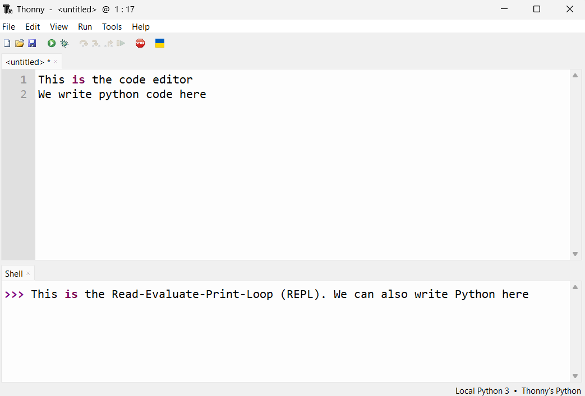

# Development 🧑‍💻

Let's get familiar with the two main parts of Thonny.



1. The **code editor**: This is where we will write our Python code. We use it like we do Microsoft Word

2. The **REPL**: This stands for Read-Evaluate-Print-Loop. This bit is interactive. When we enter a valid Python instruction (that is, type the instruction after the `>>>` then press the `enter`/`return` key), we will immediately see the result

Thonny is an **IDE**: An Integrated Development Environment. An IDE is any kind of editor that has multiple sections that are for different things, like editing code, running coding interactively (like a REPL), and managing files.

!!! note "Viewing files in Thonny"

    To see your files, select "View" then check "Files" in the menu.

    

!!! note "Code IDEs vs Word Processors"

    MS Word and Google Docs are examples of word processors. These apps deal with _rich_ text, which is text that is embellished with lots of extra notation so that the text can have fancy styles like bolding, colours, highlights, and different sizes.

    However, this also means we can't write Python code in MS Word. All the extra markup confuses the Python interpreter. See [this video](https://www.youtube.com/watch?v=X34ZmkeZDos) to get an idea.

    Instead we write Python code in a plain text file with the file extension `.py`. Plain text is the kind you would write in Notepad (Windows) or TextEdit (Mac). You can't change the styling of the text, but it's much simpler; it's plain.


## Coding is Writing is Thinking

Writing Python code is more than typing some words into Thonny.
It is writing, and writing is thinking on paper.
People who write well know how to sort out their thoughts, critique them, refine them, and express them in an accessible way to other people. The same can be said for Python. You can write convoluted code, or write simple, elegant code that says nothing beyond what it needs to say, to do things it needs to do.

Just like writing, learning to code well takes time. Goole developer and leading AI-researcher Peter Norvig wrote about this best in his blog post ["Teach Yourself Programming in Ten Years"](https://www.norvig.com/21-days.html). Do not be tempted to skim! Read it over in its entirety to set your expectations for learning to code.

!!! tip "Read it!"

    Even if you don't understand most of it, please read [Teach Yourself Programming in Ten Years](https://www.norvig.com/21-days.html).
    The blog post is aimed at people interested in professional software development. That may or may not be you, but all I want you to get out of it is that learning to code will take time and effort, so don't worry if you feel it's taking a long time for you get the hang of Python. We're all in the same boat!

## Solving Problems with Code

It's important to have a good grasp of the problem you're trying to solve with Python
(or knowing if you even need Python at all!). In his book, "Code Complete", Steve McConnell laid out a few key components of the development process[^1]:

[^1]: The full software development process is much lengthier and much more involved, but for a beginner programmer it may be a bit intimidating

| Part of Process | Description |
| --- | --- |
| Problem definition | What problem are we trying to solve? (Don't offer solutions yet!) |
| Requirements development | What features does our solution have to have? Does Python offer these features? |
| Construction planning | Think about how we could implement the solution, step by step |
| Coding & debugging | Implement the solution in Python. Fix bugs. |
| Unit testing | Test! Test! Test! Write lots of tests for your Python code. Retest when you make changes |

!!! info "Apps vs Scripts"

    A **script** is a short piece of code, usually in a single file, that does one main thing.
    Scripts are different from applications, or apps, which are more complicated pieces of software that can do many things. Compare the script above to something like your calendar app. If you want to make a calendar app, you need to seriously make a solid plan for how you will develop the app and make sure to test, test, test!

    Python is one of the best languages for creating scripts.
    For example, this script fetches a random useless fact from the internet:

    ```python
    """uselessfact.py
    This script fetches a useless fact from the useless facts website
    """
    from urllib import request
    # Data from the internet is passed around in a format called JSON
    import json

    # Fetch useless fact from some website in JSON form
    response = request.urlopen("https://uselessfacts.jsph.pl/api/v2/facts/random")

    match response.status:
        case 200:
            # Successful request!
            print("Did you know?")
            # Convert JSON form to something easier to work with in Python
            useless_fact = json.loads(response.read())
            print(useless_fact["text"])
        case 404:
            print("Uh oh, couldn't find a useless fact :(")
        case _:
            # Any other response code is a mystery...
            print("Not sure what happend, but no useless fact :(")
    ```

    Even if you don't understand what exactly is happening, don't worry.
    Type the script into the Thonny code editor, and run it a few times (by pressing the green run button, or pressing `F5` on your keyboard) to get some useless facts.

    
## Exercises

**Q1.** What is the process for writing code?

??? success "Answer"

    | Part of Process | Description |
    | --- | --- |
    | Problem definition | What problem are we trying to solve? (Don't offer solutions yet!) |
    | Requirements development | What features does our solution have to have? Does Python offer these features? |
    | Construction planning | Think about how we could implement the solution, step by step |
    | Coding & debugging | Implement the solution in Python. Fix bugs. |
    | Unit testing | Test! Test! Test! Write lots of tests for your Python code. Retest when you make changes |


**Q2.** Consider this Python code that verifies if someone is old enough to drink

```python
age = int(input("Please enter your age: "))

drinking_age = 19

if age == drinking_age:
    print("You may enter the bar")
else:
    print("Sorry, you are not old enough to drink")
```

Type it into Thonny, then run it. You can enter an age by typing it into the Shell, then pressing the `enter`/`return` key.


i. Does the program do what it's supposed to? Why or why not? Rerun the code and try a few different ages

??? success "Answer"

    No, the code produces an incorrect result for ages greater than 19. It should respond "You may enter the bar".

    This is because the code checks if `age` equals `drinking age`. Instead it should check if `age` is greater than or equal to `drinking_age`.
    
    Don't worry if you weren't sure how to read the Python script, yet (after all, we haven't properly gone over the basic words and phrases you can use in Python).
    
    If you were able to figure it out, great! Can you try and fix the code? 

ii. Can you think of any inputs you can give that will crash the program (i.e. cause it to throw an error)?

??? success "Answer"

    The program will crash if you provide inputs that don't make any sense, like letters or punctuation.

    If you haven't already, try running the code again and input `abc` or something similar.

iii. Why is testing your code so important?

??? success "Possible Answers"

    It's easy to accidentally mistype something without realizing it, so you need to run tests to bring your attention to errors in your code

    It's also useful to think about all the invalid inputs that you or other people could give when using your Python scripts. Testing and then tweaking your code helps make sure your scripts are more robust.
